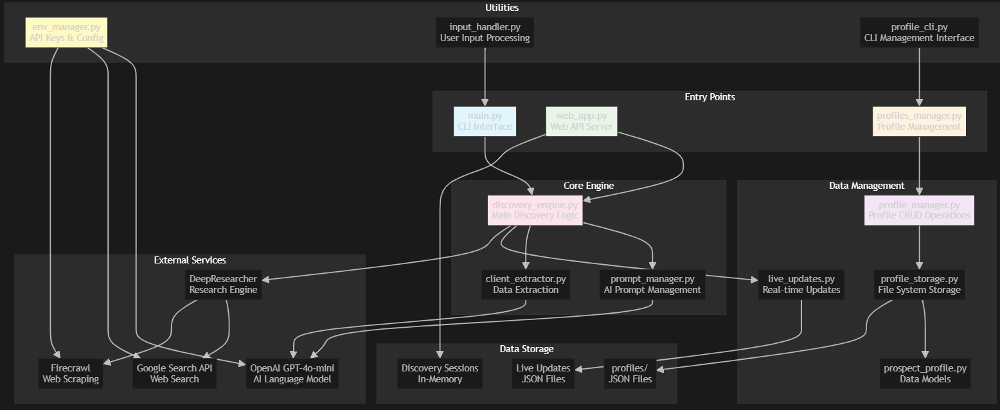

# Pregame Intelligent Discovery Engine

Pregame is your AI-powered intelligent prospect discovery engine that analyzes your company and goals to find the perfect prospects automatically.

Instead of generic searches, manual research, or endless networking — Pregame uses AI to understand your unique business situation and goals, then finds prospects that are genuinely aligned with what you're trying to achieve.

## 🎯 How It Works

1. **Tell us about your company** - Industry, size, what you do, your value proposition
2. **Describe your goal** - What you want to achieve (find clients, investors, partners, etc.)
3. **AI analyzes your situation** - Determines the best prospect types and search strategy
4. **Intelligent discovery** - Finds prospects that match your specific goal
5. **Smart qualification** - Assesses each prospect's relevance and fit
6. **Actionable results** - Get prospects with goal alignment scores and approach strategies

## 🚀 Key Features

- **AI-Powered Analysis**: Understands your company profile and goals to determine the best prospects
- **Goal-Based Discovery**: Works for any objective - clients, investors, partners, collaborators
- **Intelligent Qualification**: Each prospect is assessed for relevance to your specific goal
- **Real-Time Progress**: Live JSON updates track discovery progress
- **Smart Insights**: AI provides strategic recommendations and approach suggestions
- **Personalized Results**: Every search is tailored to your unique business situation

## 💡 Example Goals

- "Find 20 B2B SaaS companies that need AI automation"
- "Get potential clients for our digital marketing agency"
- "Find investors for our fintech startup"
- "Discover strategic partners in the healthcare industry"
- "Connect with potential collaborators for our research project"

## 🛠️ Getting Started

### Project Structure
```
pregame/
├── run.py              # Web application launcher
├── frontend/           # Frontend templates and static files
│   ├── templates/      # HTML templates
│   └── static/         # CSS, JS, images
├── backend/            # Backend application code
│   ├── src/            # Core modules
│   ├── web_app.py      # Flask web application
│   ├── main.py         # CLI entry point
│   └── requirements.txt # Dependencies
└── README.md
```

### Architecture Overview

The backend follows a modular architecture with clear separation of concerns:



**Key Components:**
- **Entry Points**: CLI (`main.py`), Web API (`web_app.py`), Profile Manager (`profiles_manager.py`)
- **Core Engine**: Discovery Engine, Prompt Manager, Client Extractor
- **Data Management**: Profile Manager, Storage Layer, Data Models
- **Utilities**: Environment Management, Input Handling, CLI Interface
- **External Services**: OpenAI GPT-4o-mini, Google Search API, DeepResearcher, Firecrawl
- **Data Storage**: JSON-based file system with in-memory session management

### Installation

1. **Install dependencies**:
   ```bash
   cd backend
   pip install -r requirements.txt
   ```

2. **Set up your API keys** in `.env.local` (in project root):
   ```
   OPENAI_KEY=your_openai_api_key
   GOOGLE_API_KEY=your_google_api_key
   GOOGLE_CX=your_google_cx_id
   FIRECRAWL_KEY=your_firecrawl_api_key
   ```

### Usage

#### Web Application
```bash
python run.py
```
Then visit: http://localhost:5000

#### Command Line Interface
```bash
cd backend
python main.py
```

Follow the interactive prompts to describe your company and goal

## 📊 What You Get

- **Intelligent Analysis**: AI assessment of your prospect needs
- **Qualified Prospects**: Each with relevance scores and fit analysis
- **Contact Intelligence**: Best approach strategies and timing
- **Live Tracking**: Real-time progress in JSON format
- **Actionable Reports**: Professional markdown reports with insights

## 🧠 AI Intelligence Features

- **Company Analysis**: Understands your business model and target market
- **Goal Interpretation**: Determines exactly what type of prospects you need
- **Smart Search**: Uses optimized queries based on your specific situation
- **Relevance Scoring**: Ranks prospects by how well they match your goal
- **Approach Optimization**: Suggests the best way to reach each prospect

---

*Powered by advanced AI research and qualification engines*
